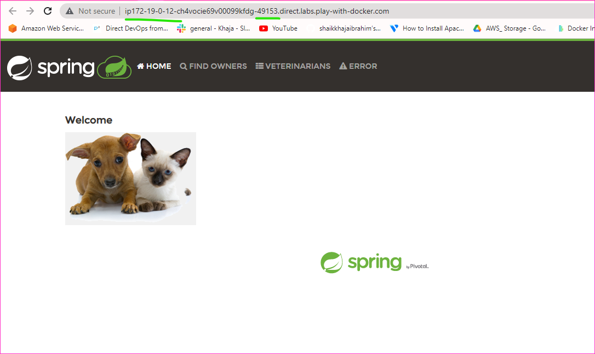

21-04-2023
----------

Nop Commerce Application
------------------------

### Mutli Stage Docker file

* Steps involved
    * Installing neccessary prequisties like
        * Unzip (apt)
        * Dotnet 7 (will take from image)
    * Here we have download a zip file from url and extract it and then run dll command , which will make our image bulk
    * If we wanted make in 2 stage i.e
        * Downloading zip file and extracting
        * Copy the extracted folder and run application
    * Here we can use multi satge docker file

* [Refer Here](https://github.com/qtaarkayapril23/docker-tasks/blob/main/27april23.md/NopCommerce/Dockerfile) for the nopcommerce dockerfile.

```
docker image build -t nopcommerce:1.0 .
docker image ls
docker container run -d -P --name msnopcommerce nopcommerce:1.0
docker container ls
```
  


### Pushing the Image to dockerhub

```
docker image tag nopcommerce:1.0 rajkumar207/nopcommerce:1.0
docker login
username:  rajkumar207
password:  RRajkumar4@GGummadi
docker image push rajkumar207/nopcommerce:1.0
```
 
 


### Pusing to Azure Container Registry

* For container registry creation and pushing [Refer Here](https://learn.microsoft.com/en-us/azure/container-registry/container-registry-get-started-portal?tabs=azure-cli)


```
az login
az acr login --name dockerimages
docker login dockerimages.azurecr.io
docker image tag rajkumar207/nopcommerce:v1.0 dockerimages.azurecr.io/nopcommerce:1.0
docker image push dockerimages.azurecr.io/nopcommerce:1.0
```

* Here faced a issue with authorization and region
* Created access keys and given username and password from access keys
* Created in the region of East US, with region central india error came 


### Docker Compose File - nopCommerce

* [Refer Here](https://github.com/qtaarkayapril23/docker-tasks/blob/main/27april23.md/NopCommerce/docker-compose.yaml) for the docker-compose.yaml file.

```
docker compose up -d
docker compose down # if u want to down conatiners
```
 
 


Spring-Petclinc Application
----------------------------

### Multi Stage Docker file

* Pre-Requires
    * java-17
    * maven -3.6
* Manual Steps
```
git clone https://github.com/spring-projects/spring-petclinic.git
cd spring-petclinc
mvn package
java -jar spring-petclinic.jar
```

* [Refer Here](https://github.com/qtaarkayapril23/docker-tasks/blob/main/27april23.md/Spring-Petclinic/Dockerfile) for the spring-petclinic dockerfile.

```
docker image build -t spc:1.0 .
docker image ls
docker container run -d -P --name spclinic spc:1.0
docker container ls
```
 
 


### Pushing the Image to dockerhub

```
docker image tag spc:1.0 rajkumar207/spclinic:1.0
docker login
username: rajkumar207
password: RRajkumar4@GGummadi
docker image push rajkumar207/spclinic:1.0
```
 


### Pushed to Azure ACR

```
az login
az acr login --name srdockerimages
docker login dockerimages.azurecr.io
docker image tag rajkumar207/spc:1.0 dockerimages.azurecr.io/spc:1.0
docker image push dockerimages.azurecr.io/spc:1.0
```

Docker-Compose File for SPC

* [Refer Here](https://github.com/qtaarkayapril23/docker-tasks/blob/main/27april23.md/Spring-Petclinic/docker-compose.yaml) for the file called docker-compose.yaml

![Preview] 
![Preview]


Students Courses Register RestAPI
----------------------------------

* Pre-Requires
    * python3 
    * pip
* Manual Steps
  
```  
git clone https://github.com/DevProjectsForDevOps/StudentCoursesRestAPI.git
cd StudentCoursesRestAPT
pip install -r requirements.txt
python app.py
```

### Multi Stage Dockerfile

* [Refer Here](https://github.com/qtaarkayapril23/docker-tasks/blob/main/27april23.md/Student-Course_RestAPI/Dockerfile) for the dockerfile called student-course-restapi.

* To create docker image build and run the container
* We can execute the below commands 
```
docker image build -t scrmulti:1.0 .
docker container run -d -P --name scrmulti scrmulti:1.0
```
![Preview] 
![Preview] 
![Preview] 


### Pushing the Image to dockerhub

```
docker login
docker image tag scrmulti:1.0 rajkuamr207/scr:1.0
docker image push rajkumar207/scr:1.0
```
![Preview] 


### Pushed to Azure ACR

already login to docker and acr -refer above to login procedure in spc
as i build image in docker playground..didnot signed in ACR in that machine
so pulling image from docker hub

```
docker image pull rajkumar207/scr:1.0
docker image tag rajkumar207/scr:1.0 srdockerimages.azurecr.io/scr:1.0
docker image push srdockerimages.azurecr.io/scr:1.0 
```
![Preview] 
![Preview]

### Docker-Compose File For SCR

* [Refer Here](https://github.com/qtaarkayapril23/docker-tasks/blob/main/27april23.md/Student-Course_RestAPI/docker-compose.yaml) for the spring petclinic file called docker-compose.yaml

```
docker compose up -d
docker compose down (#if u want to down the containers)
```
![Preview] 
![Preview]
![Preview] 
![Preview]


Running containers with specific User
-------------------------------------

* To run containers with specific user , we have to create user and group
* We have use `USER` and `WORK_DIR` directives in Dockerfile
* To Create a user and group in Dockerfile
* Commands will be as per os image
* FOR Ubuntu Example of nopCommerce


ARG user=nopcommerce
ARG group=nopcommerce
ARG uid=1000
ARG gid=1000
ARG DOWNLOAD_URL=https://github.com/nopSolutions/nopCommerce/releases/download/release-4.60.2/nopCommerce_4.60.2_NoSource_linux_x64.zip
ADD --chown=${user}:${group} ${DOWNLOAD_URL} ${HOME_DIR}/nopCommerce_4.60.2_NoSource_linux_x64.zip
ARG HOME_DIR=/nop
RUN groupadd -g ${gid} ${group} \
    && useradd -d "$HOME_DIR" -u ${uid} -g ${gid} -m -s /bin/bash ${user}
USER ${user}
WORKDIR ${HOME_DIR}


* FOR alpine os
* Spring pet clinic


FROM alpine/git AS VCS
RUN cd / && git clone https://github.com/spring-projects/spring-petclinic.git 

FROM maven:3.9-amazoncorretto-17 AS Builder
COPY --from=VCS /spring-petclinic /spring-petclinic
RUN cd /spring-petclinic && mvn package

FROM amazoncorretto:17-alpine-jdk
LABEL author="aarkay" org="qt" project="multistage-spc"
ARG HOME_DIR=/spring-petclinic
ARG USER=dev
ARG GROUP=dev
ARG UID=1000
ARG GID=1000
RUN addgroup -g ${GID} ${GROUP} && \
adduser -h ${HOME_DIR} -u ${UID} -G ${GROUP} -D -s /bin/bash ${USER}
USER ${USER}
WORKDIR ${HOME_DIR}
COPY --from=Builder /spring-petclinic/target/spring-*.jar ${HOME_DIR}/spring-petclinc.jar
EXPOSE 8080
CMD [ "java","-jar","spring-petclinc.jar" ]

![Preview]