Tasks in 14-04-2023
--------------------

### 1.Run hello-world docker container and observe the container status

```
docker container run -d --name helloworld hello-world
docker container ls
docker container ls -a 
``` 
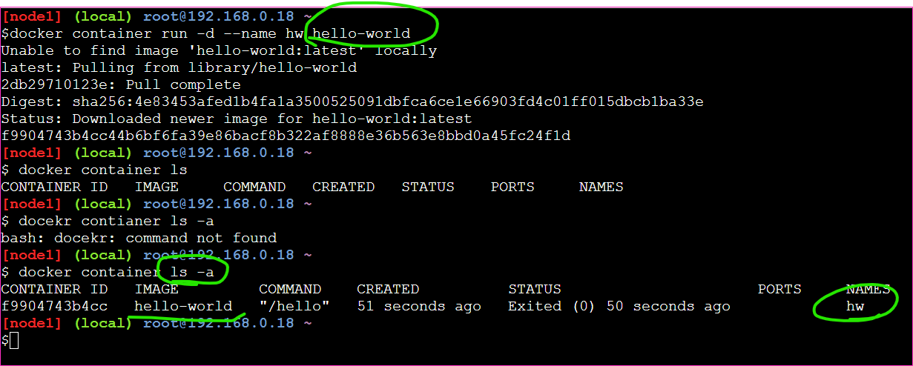
* status of container is not running 
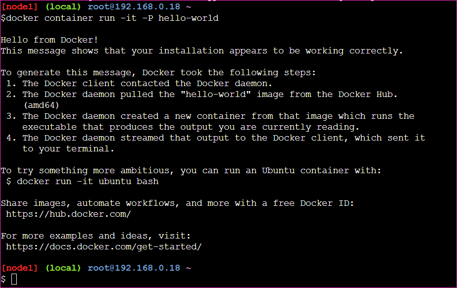

### 2.Check the docker images and also write down the size of hello-world image
```
docker image ls
``` 
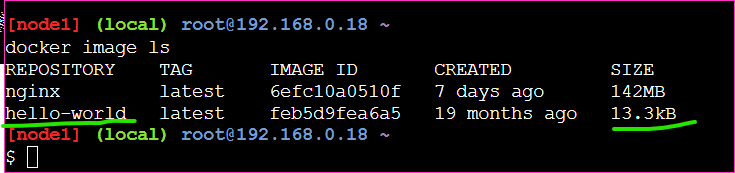

### 3.Run the nginx container with name as nginx1 and expose it on 8080 port on docker host

```
docker container run -d -p 8080:80 --name nginx1 nginx
``` 
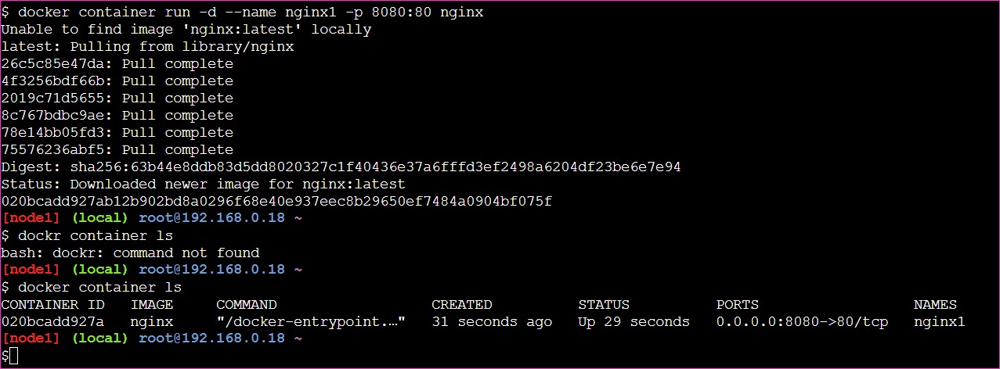 
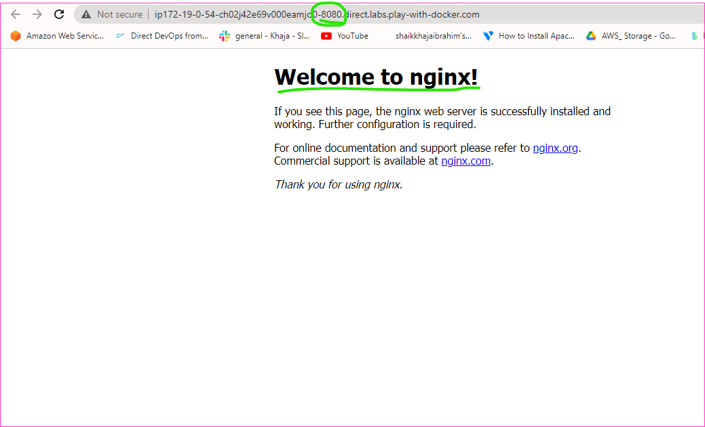


### 4.Explain docker container lifecycle

* There are different stages in docker, when we create docker contianers, which is known as Docker container lifecycle
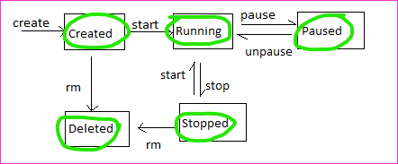

* The stages are
     * Created
     * Running
     * Paused
     * Stopped
     * Deleted 

> Create Containers
* Using docker container create command will create a container with specified docker image

docker container create --name <container name> <imagename>:<tag> 
```
docker container create --name nginx nginx
docker container ls
docker container ls -a
```
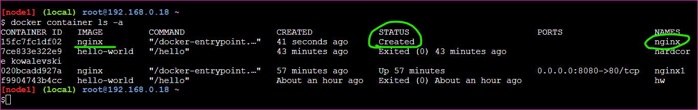
* Here if we observe create command only creates container ,it will not run the container
* If we run docker container ls it will not be shown.
* If we run docker container ls -a then only it will be shown.
* Status : is created , not running

> Start Containers
* Using docker container start command we will start the already created container

docker container start <container name>
```
dockre container start nginx
```
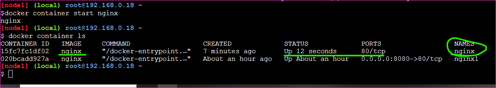

* Here the status of container is up and running
* If we execute `docker container ls` it will shown

> Run Containers
* Using `docker container run` command will do work of both `create` and `start` commands
* It will create container and also up and running

docker container run -d -P --name <container name> <image name>:<tag> preview
```
docker container run -d -P --name qtnginx nginx
```
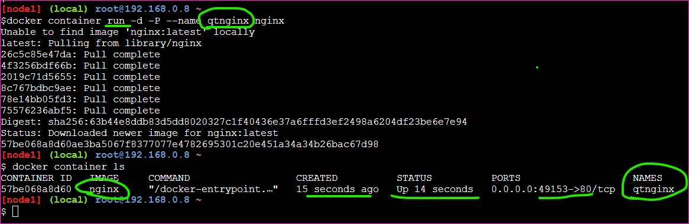
* So by using `docker container run` command : it will create and start the container

> Pause Containers
* Using `docker container pause` command ,we will `pause` the processes of container

docker container pause <container name>
```
docker container pause qtnginx
```
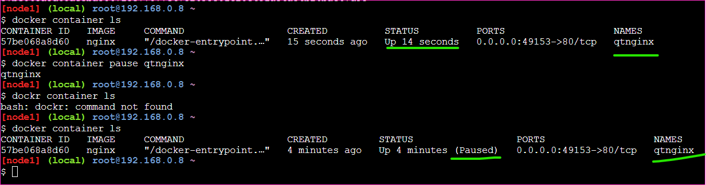
* Here it will pause our application loading ,but it will be visible in `docker container ls`
* Now we can again run container by using `unpause` 
```
docker container unpause qtnginx
```
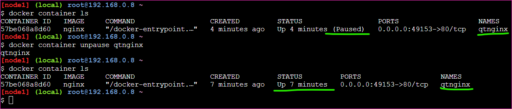

> Stop Container
* Using `docker container stop` command we can stop the running container
  
docker container stop <container name> 
```
docker container unpause qtnginx
```
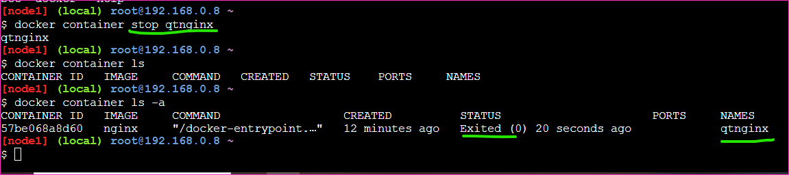
* It will completly stop container
* If we want we can again start containe by `docker container start` command

> Delete Container
* Using `docker container rm` we can delete the containers
  
docker container rm <container name>
```
docker container rm qtnginx
```
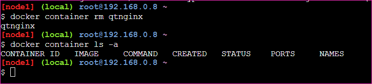

* From the above command we can delete the container which is stopped, running containers cannot be delete by this
* Running conatiners can be deleted by using `force` option

docker container rm -f <container name>
```
docker container rm -f qtnginx
```
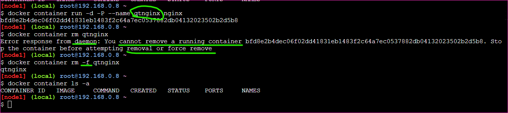


### 5.Explain what happens when you run the docker container
* When we run docker container
   * first it will download the docker image from registry or local
   * and then creates a docker container
   * and start that container
   * After creation of container ,it will get
      * new process tree
      * disk mount or file system
      * network -nic
      * cpu/memory
      * users


### 6.Explain the Docker architecture
* Docker uses a client-server architecture. 
* The docker client talks to the Docker daemon, which used to building, running, and distributing the Docker containers. 
* The Docker client and daemon communicate using a REST API, over UNIX sockets, or a network interface.


* Original Image

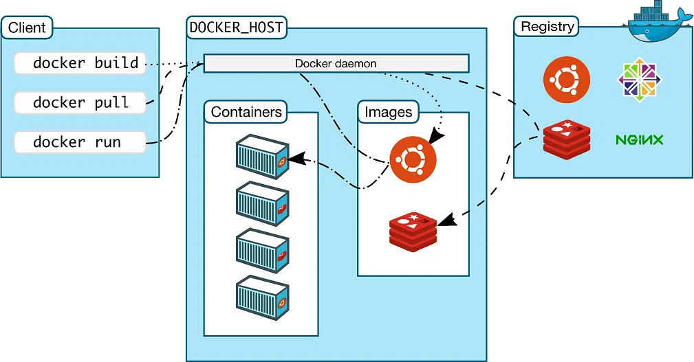

* There are five major components in the Docker architecture:
    * Docker Daemon: listens to Docker API requests and manages Docker objects such as images, containers, networks and volumes.

    * Docker Clients: 
        * With the help of Docker Clients, users can interact with Docker. 
        * Docker client provides a command-line interface (CLI) that allows users to run, and stop application commands to a Docker daemon.

    * Docker Host:
        * Docker Host provides a complete environment to execute and run applications. 
        * It comprises of the Docker daemon, Images, Containers, Networks, and Storage.

    * Docker Registry:
        * Docker Registry stores Docker images.
        * Docker Hub is a public registry that anyone can use, and Docker is configured to use images on Docker Hub by default. 
        * You can run your own registry on it.

    * Docker Images: 
        * Docker Images are read-only templates that you build from a set of instructions written in Dockerfile. 
        * Images define both what you want your packaged application and its dependencies to look like what processes to run when it’s launched.


Tasks in 15-04-2023
---------------------

### 1.write a Dockerfile for nodejs application

* Github repository [refer here](https://github.com/expressjs/express) for the nodejs application


* Dcoker file for express nodejs
```
FROM node:16-alpine
LABEL authour="aarkay" project="nodejs" org="qtdevops"
RUN apk add git 
RUN apk add npm
RUN git clone https://github.com/expressjs/express.git 
RUN cd express && npm install express && \
npm install -g express-generator@4 && \
express /tmp/foo && cd /tmp/foo && npm install 
EXPOSE 3000
WORKDIR /tmp/foo
CMD [ "npm", "start" ]
```

docker run --rm --entrypoint /bin/sh <image-name> -c "<any linux command> 
example: docker run --rm --entrypoint /bin/sh <image-name> -c "cat /path/to/file" to cat content

* For execution
```
docker image build -t node:v1.0 .
```


Tasks in 16-04-2023
--------------------

### 1.Login into mysql container and create a table

* For login into mysql container, to create linux machine and install docker

```
docker --version
curl -fsSL https://get.docker.com -o get-docker.sh
sh get-docker.sh
sudo usermod -aG docker ubuntu
exit
relogin
docker info
```
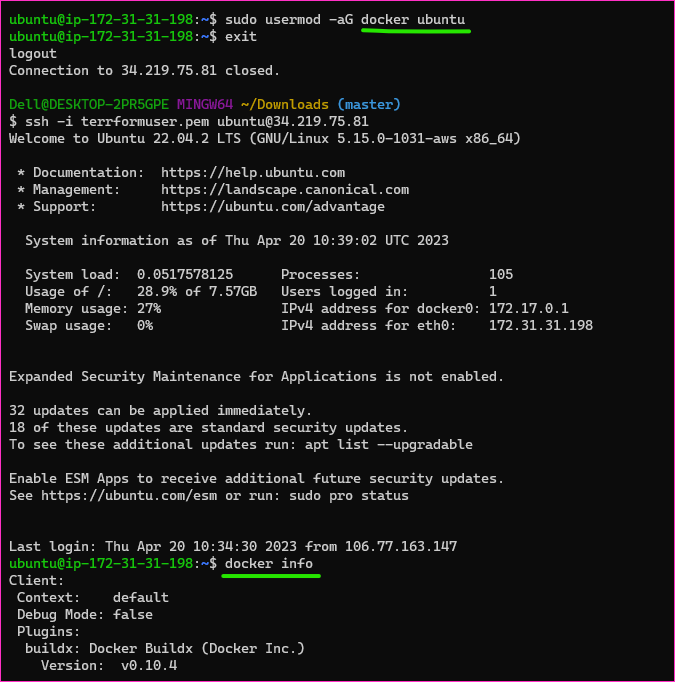

* To login into mysql container
```
docker container run -d -P --name mysql -e MYSQL_ROOT_PASSWORD=aarkay -e MYSQL_DATABASE=employees -e MYSQL_USER=qtuser -e MYSQL_PASSWORD=aarkay mysql:8
```
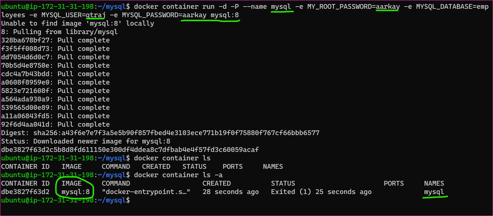
```
docker container exec -it mysql mysql --password=aarkay
```

```
mysql> use employees;

mysql> CREATE TABLE Persons (
        PersonID int,
        LastName varchar(255),
        FirstName varchar(255),
        Address varchar(255),
        City varchar(255)
    );

mysql> Insert into Persons values (1,'aarkay','gummadi','rajkumar','guntur'),(2,'aarkay','sai','dangeti','godawari'),(3,'aarkay','jai','injeti','godawari'),(4,'aarkay','kishore','kumar','vizag'),(5,'aarkay','sohail','shaik','hyderabad');

mysql> Select * from Persons;
```
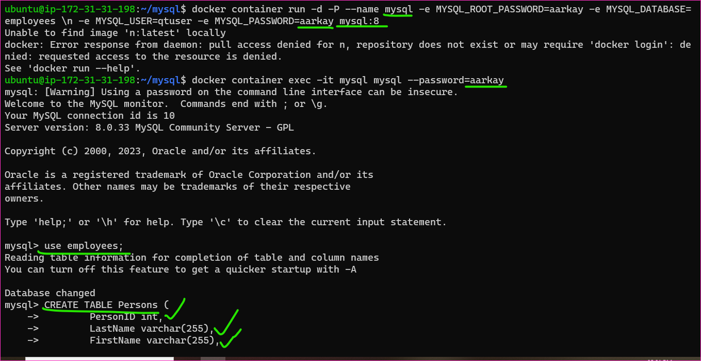


### 2.Try to create a persisted volume in mysql container and mount that to other
```
docker container run -d -P -v mydbvol1:/var/lib/mysql --name mysql -e MYSQL_ROOT_PASSWORD=aarkay -e MYSQL_DATABASE=employees -e MYSQL_USER=qtuser -e MYSQL_PASSWORD=aarkay mysql:8

docker volume ls
```
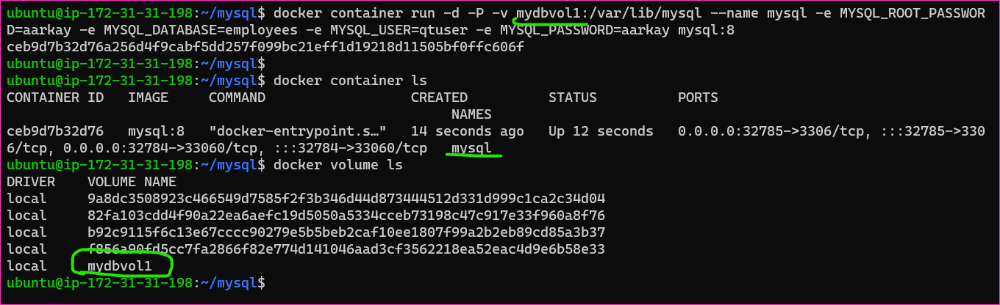


* Now to check persisted volume i am deleting mysql container
* And creating new one with mounting old vol to it
* 
```
docker container run -d -P --mount "source=mydbvol1,target=/var/lib/mysql,type=volume" --name mysqldb1 -e MYSQL_ROOT_PASSWORD=aarkay -e MYSQL_DATABASE=employees -e MYSQL_USER=qtuser -e MYSQL_PASSWORD=aarkay mysql:8

docker container exec -it mysqldb1 mysql --password=aarkay

mysql> use employees;

mysql> CREATE TABLE Persons (
        PersonID int,
        LastName varchar(255),
        FirstName varchar(255),
        Address varchar(255),
        City varchar(255)
    );

mysql> Insert into Persons values (1,'aarkay','gummadi','rajkumar','guntur'),(2,'aarkay','sai','dangeti','godawari'),(3,'aarkay','jai','injeti','godawari'),(4,'aarkay','kishore','kumar','vizag'),(5,'aarkay','sohail','shaik','hyderabad');

mysql> Select * from Persons;
```

```
docker container rm -f mysqldb1

docker container run -d -P --mount "source=mydbvol1,target=/var/lib/mysql,type=volume" --name mysqldb2 -e MYSQL_ROOT_PASSWORD=aarkay -e MYSQL_DATABASE=employees -e MYSQL_USER=qtuser -e MYSQL_PASSWORD=aarkay mysql:8

docker container exec -it mysqldb2 mysql --password=aarkay

mysql> use employees;

mysql> Select * from Persons;

```
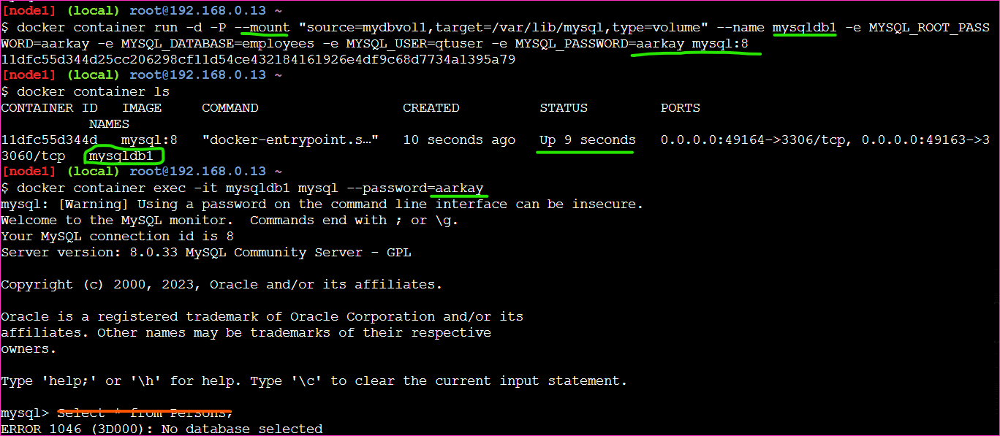
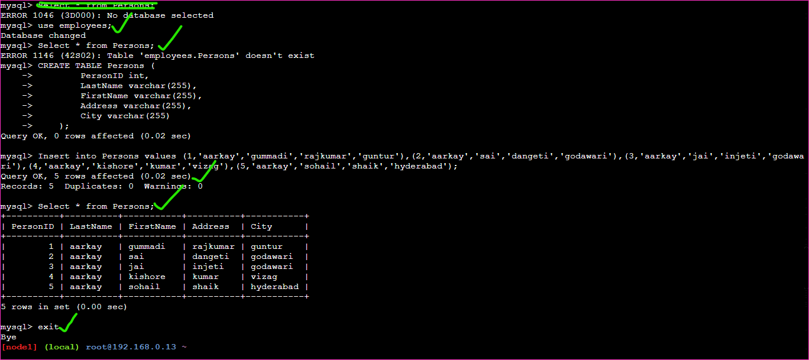
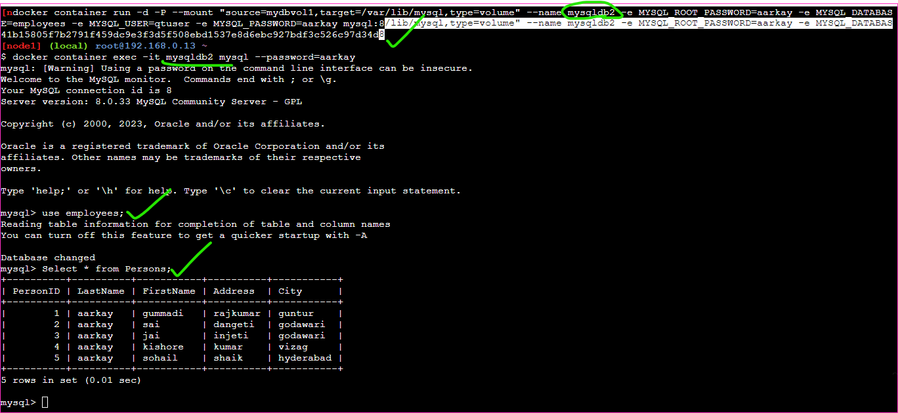


### 3.Now postgres database

```
docker container run -d -P --name psqldb4 -e POSTGRES_ROOT_PASSWORD=aarkay -e POSTGRES_USER=postgres -e POSTGRES_DB=employees -e POSTGRES_PASSWORD=aarkay postgres
```
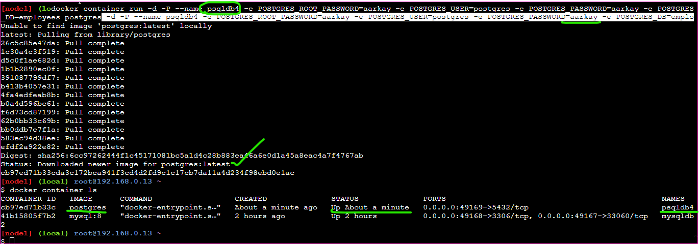

* Got an error when we try to login with below command
```
docker container exec -it psqldb4 postgres --password=aarkay
```

* Error is
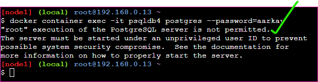

* See the documentation for, so try to login by using below commands 

```
docker container exec -it psqldb4 /bin/bash

psql -h localhost -U postgres
```
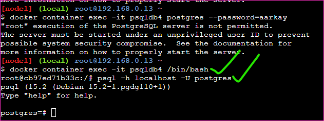

* Postgres database commands to create tables
```
postgres=# \c employees
employees=# CREATE TABLE Persons (
        PersonID int,
        LastName varchar(255),
        FirstName varchar(255),
        Address varchar(255),
        City varchar(255)
    );
employees=# INSERT INTO persons VALUES (1,'aarkay','gummadi','rajkumar','guntur');
employees=# SELECT * FROM persons5;
employees=# INSERT INTO persons VALUES (2,'aarkay','sai','dangeti','godawari'),(3,'aarkay','jai','injeti','godawari'),(4,'aarkay','kishore','kumar','vizag'),(5,'aarkay','sohail','shaik','hyderabad');
employees=# SELECT * FROM persons;
```
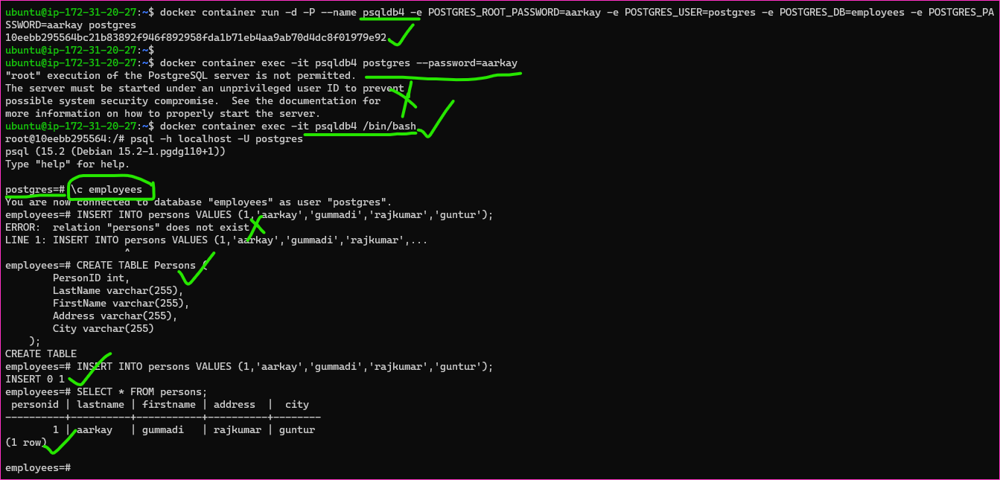
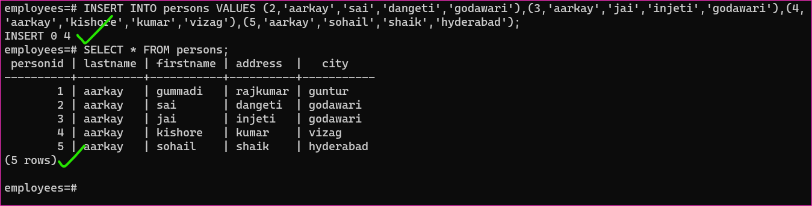


18-04-2023
-------------

### 1.Create a alpine conatiner in interactive mode and install python

```
docker container run -it --name python1 alpine /bin/sh
apk add --update python3 
```
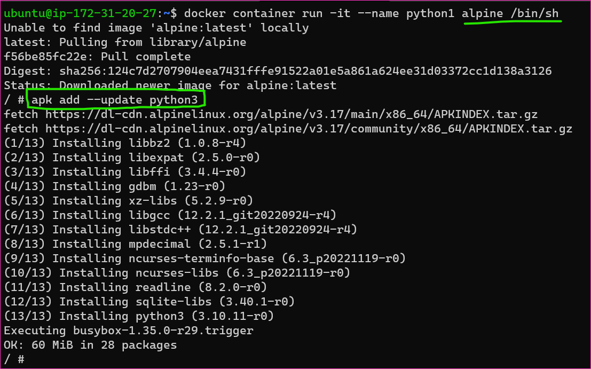


### 2.Create a ubuntu container with sleep 1d and then login using exec and install python

```
docker container run -d --name python2 ubuntu sleep 1d
docker container ls
docker container exec -it python2 /bin/bash
apt update
```
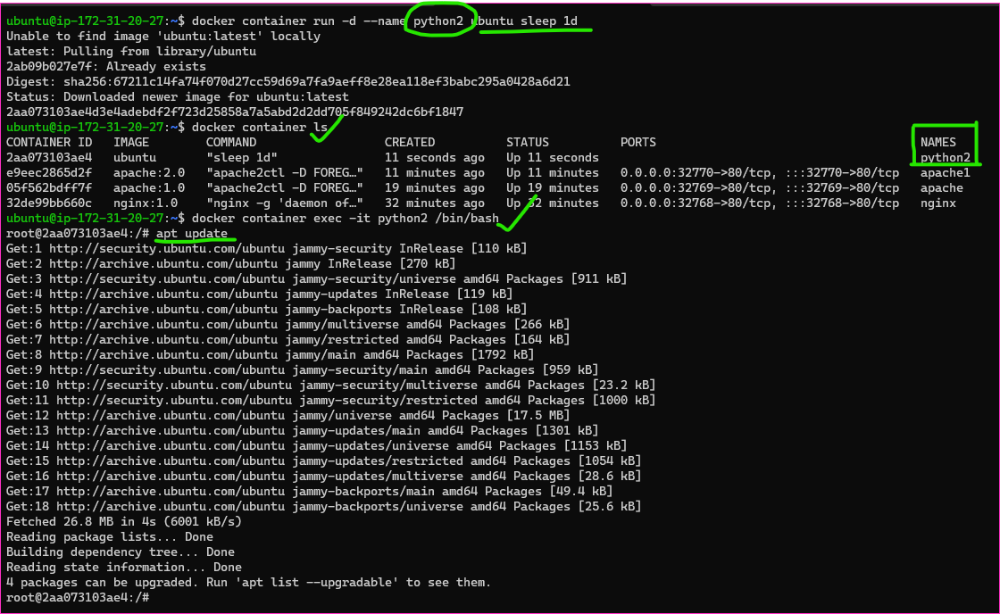

```
apt install python3 -y
```
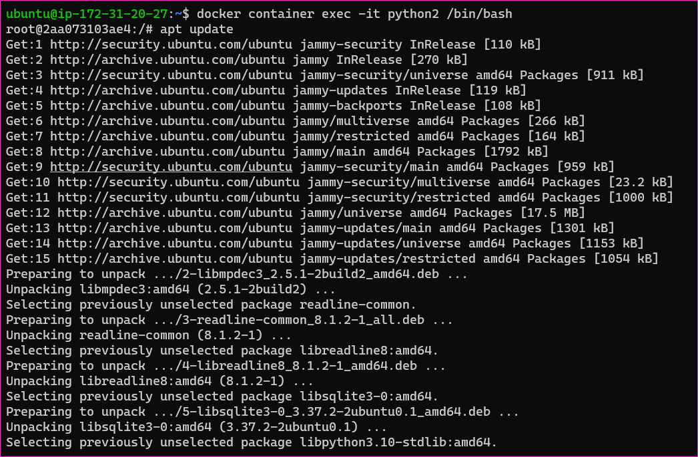
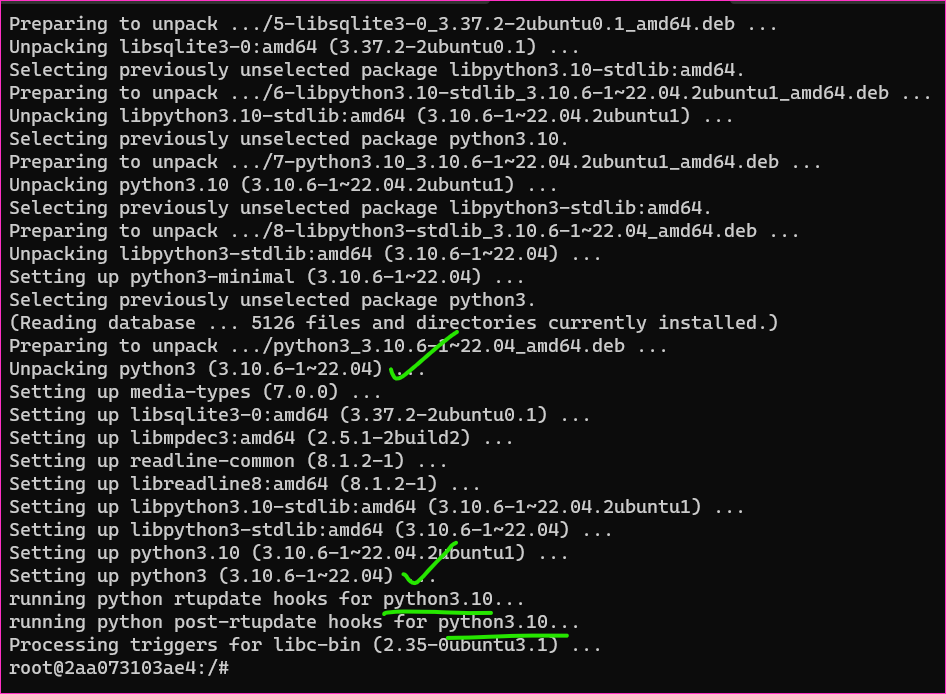


### 3.Create a postgres container with username panoramic nad password as trekking .Try logging in and show the databases (query for pasql)

```
docker container run -d -P --name psqldb1 -e POSTGRES_ROOT_PASSWORD=aarkay -e POSTGRES_USER=panoramic -e POSTGRES_DB=employees -e POSTGRES_PASSWORD=trekking postgres

docker container exec -it psqldb1 /bin/bash

psql -h localhost -U postgres (this command not working for me)
```

* `psql -U panoramic --password -d employees` (in bash terminal of container, it will ask for password) this command is working and then enter the password `trekking`, it will enter into `employees=#`

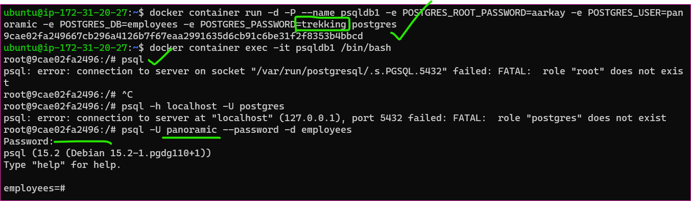
```
CREATE TABLE Persons (
        PersonID int,
        LastName varchar(255),
        FirstName varchar(255),
        Address varchar(255),
        City varchar(255)
    );

INSERT INTO persons VALUES (1,'aarkay','gummadi','rajkumar','guntur');

SELECT * FROM persons;
```
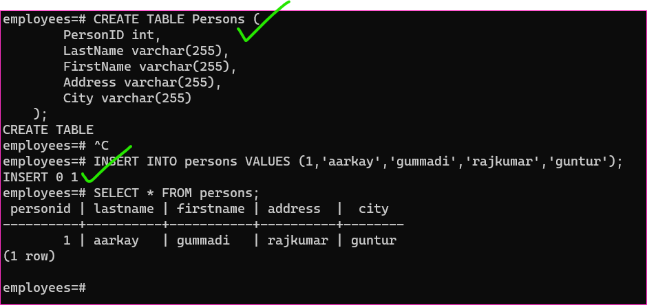

```
INSERT INTO persons VALUES (2,'aarkay','sai','dangeti','godawari'),(3,'aarkay','jai','injeti','godawari'),(4,'aarkay','kishore','kumar','vizag'),(5,'aarkay','sohail','shaik','hyderabad');

SELECT * FROM persons;
```
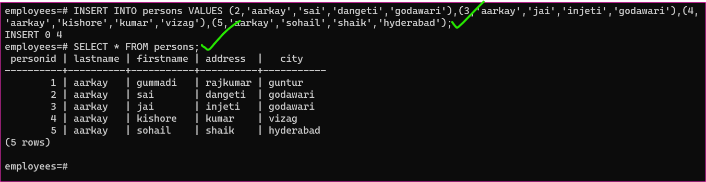


### 4.Try to create a dockerfile which runs phpinfo page, use ARG and ENV wherever appropriate on 1.apache, 2.nginx

> Apache

* Manual steps

```
sudo apt update
sudo apt install apache2 -y
sudo apt install php libapache2-mod-php -y
```

```Dockerfile
FROM ubuntu:22.04
LABEL author="aarkay" org="qt" project="apache"
ARG DEBIAN_FRONTEND=noninteractive
RUN apt update && \
    apt install vim -y && \
    apt install apache2 -y && \
    apt install php -y && \
    apt install libapache2-mod-php -y
WORKDIR /var/www/html
COPY . /var/www/html/info.php
EXPOSE 80
CMD [ "apache2ctl","-D","FOREGROUND" ]
```

* Created info.php file in local

```
docker image build -t apache:1.0 .
docker container run -d -P --name apache apache:1.0 
```
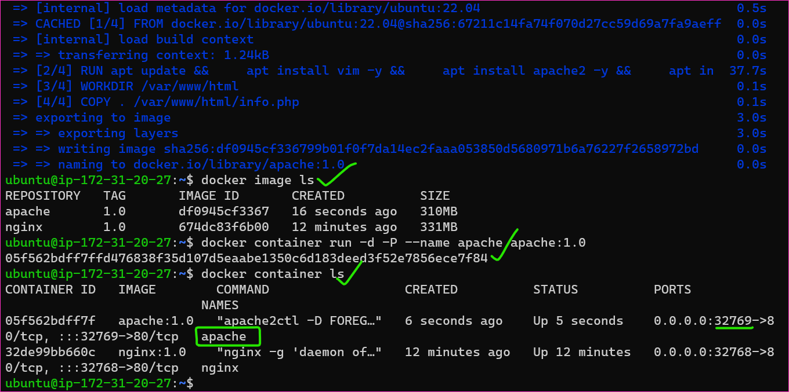 
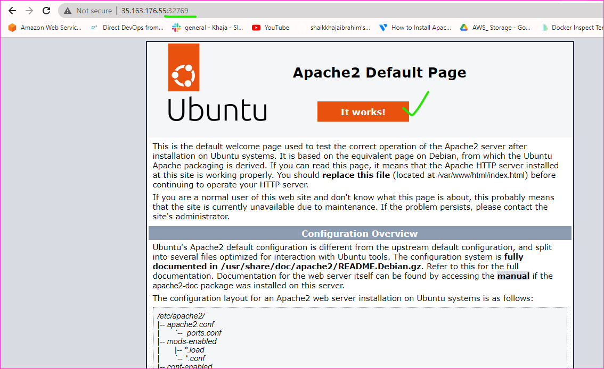
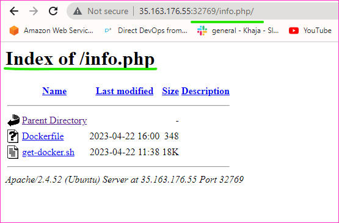

* Create PHP Script – First, create a sample PHP script to run on web server under the Docker container. Edit index.php in your favorite text editor.

```
sudo vi index.php
```
```index.php
<?php
  echo "Welcome to qtaarkay.net </br>";
  echo "Running PHP with Apache on Docker";
?>
```


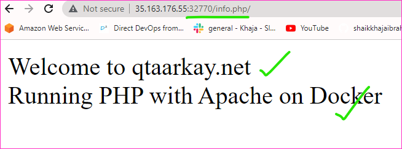

> Nginx

```Dockerfile
FROM ubuntu:22.04
LABEL author="aarkay" org="qt" project="nginx"
ARG DEBIAN_FRONTEND=noninteractive
RUN apt update && \
    apt install nginx -y && \
    apt install  php php-fpm -y 
COPY . /var/www/html/info.php
EXPOSE 80
CMD ["nginx", "-g", "daemon off;"]
```

```
docker image build -t nginx:1.0 .
docker container run -d -P --name nginx nginx:1.0 
```
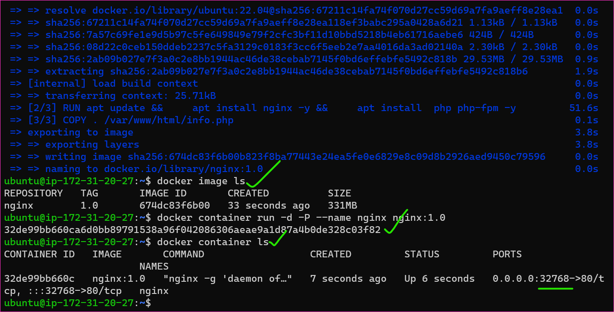
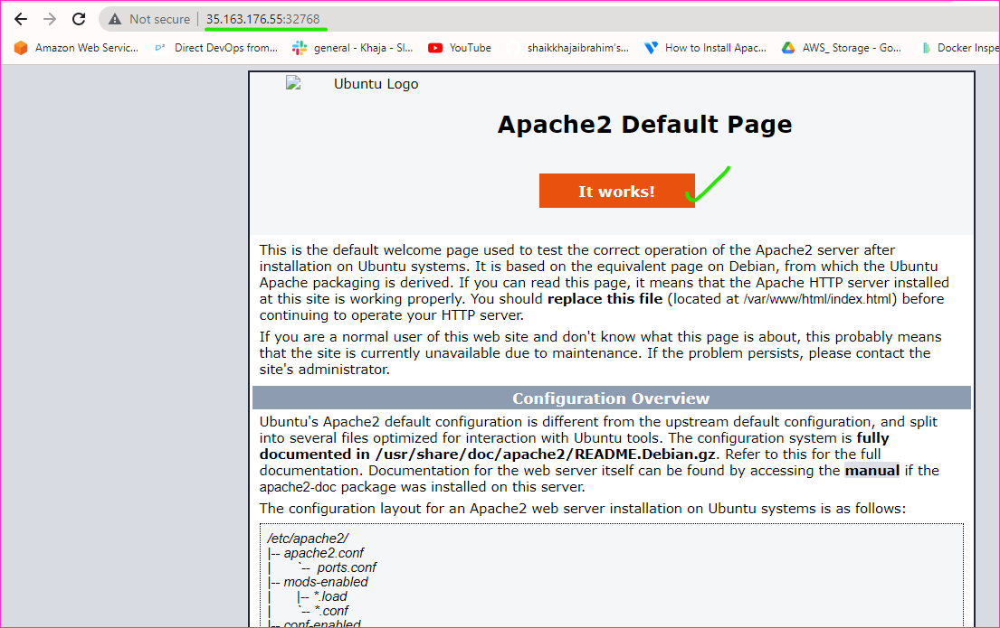
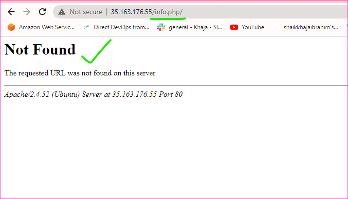


### 5.Create a jenkins image by craeting a own docker file

* Dockerfile for jenkins image

```Dockerfile
FROM ubuntu:22.04
LABEL author="srikanth" org="qt" project="Jenkins"
RUN apt update && apt install curl -y
RUN apt install openjdk-17-jdk -y
RUN curl -fsSL https://pkg.jenkins.io/debian/jenkins.io-2023.key | tee \
  /usr/share/keyrings/jenkins-keyring.asc > /dev/null && \
  echo deb [signed-by=/usr/share/keyrings/jenkins-keyring.asc] \
  https://pkg.jenkins.io/debian binary/ | tee \
  /etc/apt/sources.list.d/jenkins.list > /dev/null
RUN apt update && apt install jenkins -y 
USER jenkins
ENV JENKINS_HOME=/var/lib/jenkins
EXPOSE 8080
CMD [ "/usr/bin/jenkins" ]
```

* Here in above file important are `USER`,`JENKINS_HOME`, `CMD - /usr/bin/jenkins` - this is the ExecStart in jenkins.service file

```
docker image build -t jenkins:v1.0 .
docker container run -d -P --name jenkins jenkins:v1.0
```
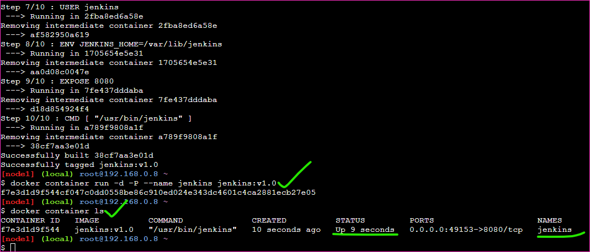
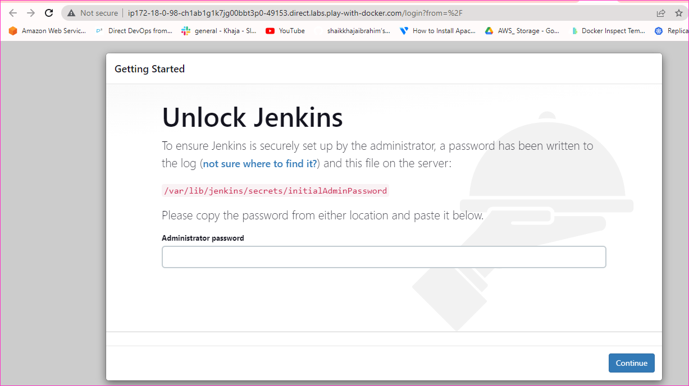

```
docker container exec -it jenkins /bin/bash
```
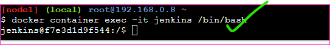

```
cat /var/lib/jenkins/secrets/initialAdminPassword
```
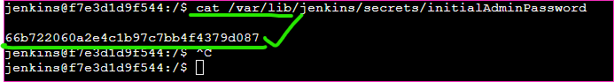
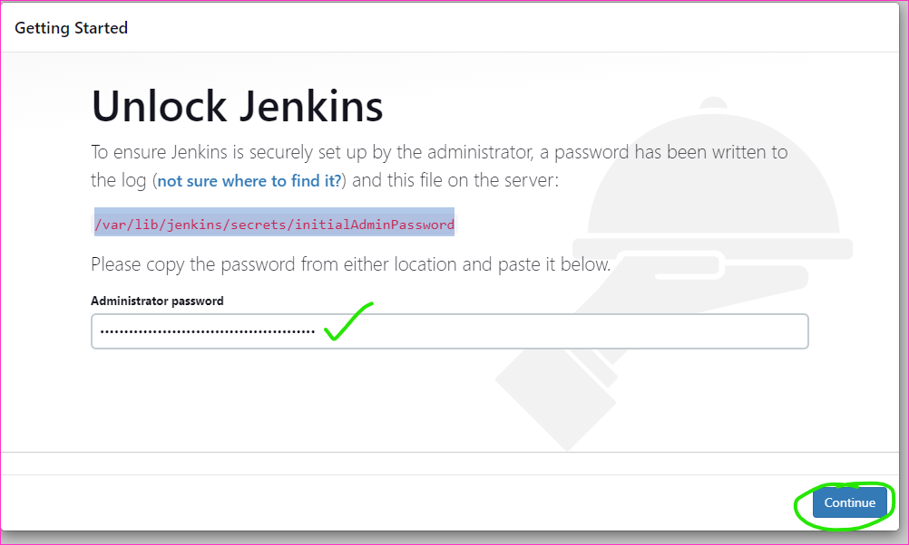
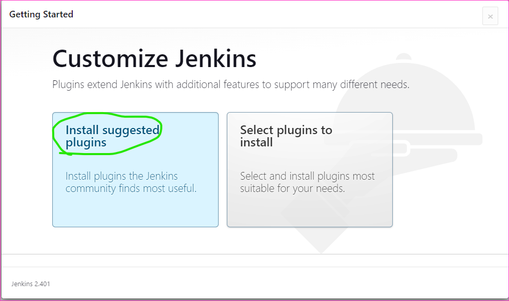
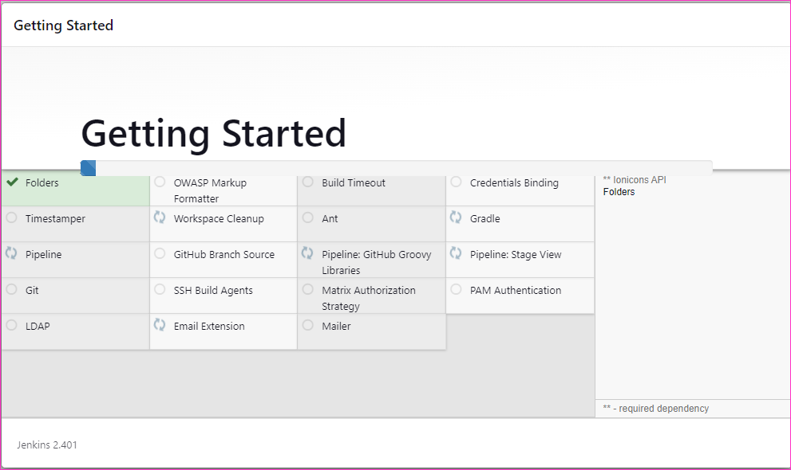
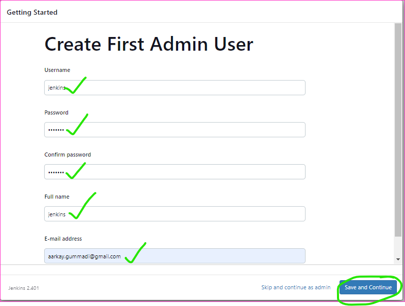
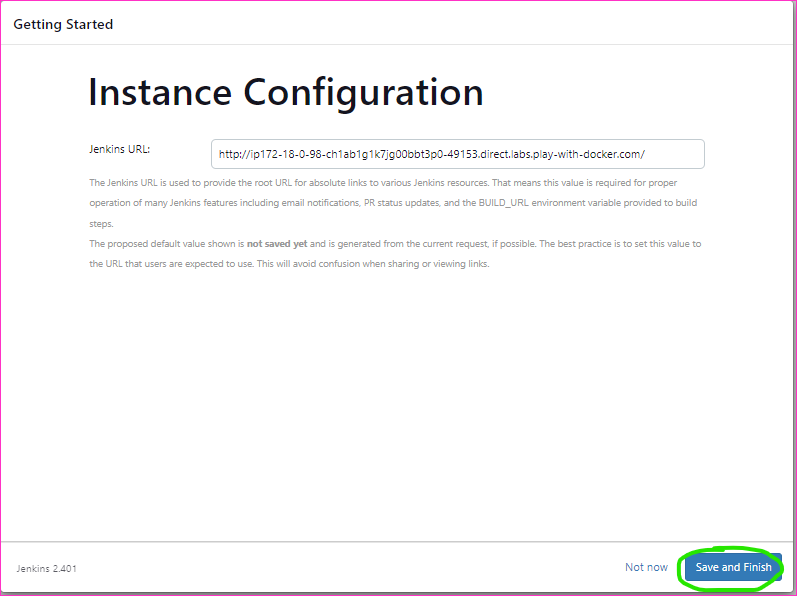
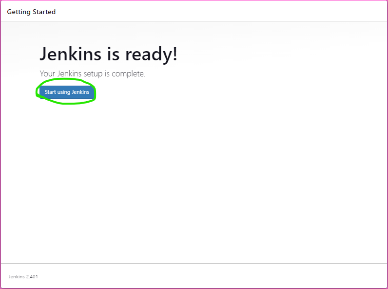
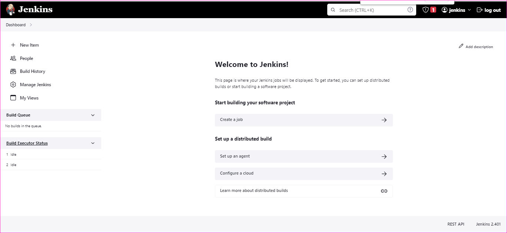


### 6.Create nop commerce and mysql server and try to make them work by configuring

* First write a docker file for nop commerce

```Dockerfile
FROM mcr.microsoft.com/dotnet/sdk:7.0
LABEL author="aarkay" org="qt" project="docker"
ADD https://github.com/nopSolutions/nopCommerce/releases/download/release-4.60.2/nopCommerce_4.60.2_NoSource_linux_x64.zip /nop/nopCommerce_4.60.2_NoSource_linux_x64.zip
WORKDIR /nop
RUN apt update && \
apt install unzip -y && \
unzip /nop/nopCommerce_4.60.2_NoSource_linux_x64.zip && \
mkdir /nop/bin && mkdir /nop/logs
EXPOSE 5000
CMD [ "dotnet", "Nop.Web.dll", "--urls", "http://0.0.0.0:5000" ]
```

* Build a docker image for nop `docker image build -t nop:v1.0 .` 
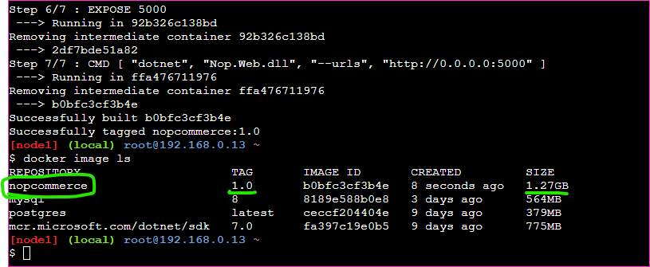

* To configure nop and mysql
    * we have to create bridge network - mybridge
    * create mysql with vol and in above network with env variables
    * create a nop with passing MYSQL_SERVER variable passing above mysql name

```
docker network create mybridge --subnet "10.0.0.0/24"

docker container run -d --name mysql --network mybridge -v mysqlvol:/var/lib/mysql -e MYSQL_ROOT_PASSWORD=aarkay -e MYSQL_USER=qtuser -e MYSQL_PASSWORD=aarkay mysql:8

docker container run -d -P --name nopcommerce --network mybridge -e MYSQL_SERVER=mysql nopcommerce:1.0 
```
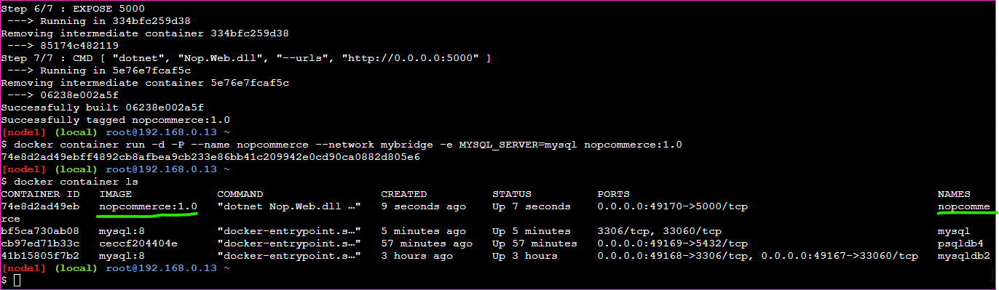

* Next open the application by port of nop and try to pass mysql server details 

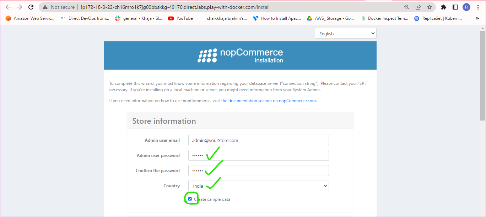 
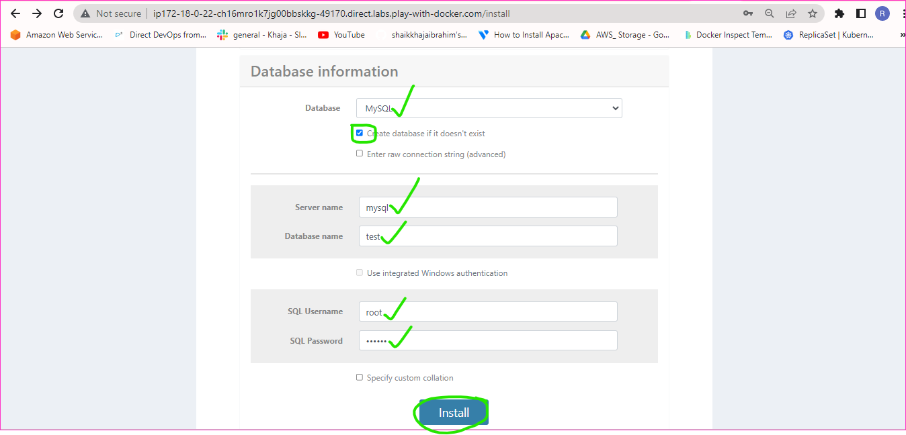 
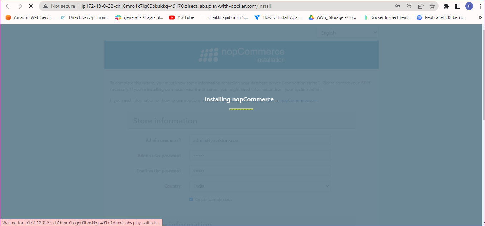
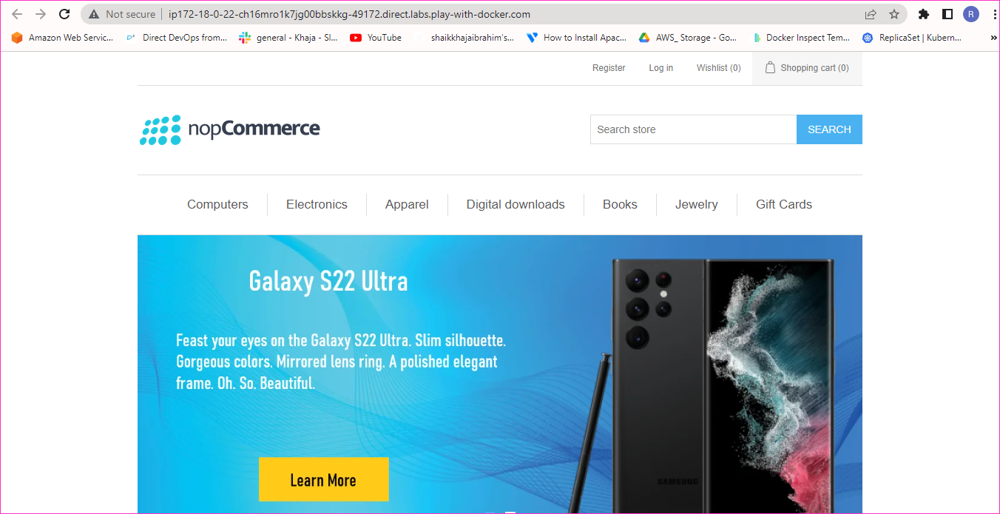


